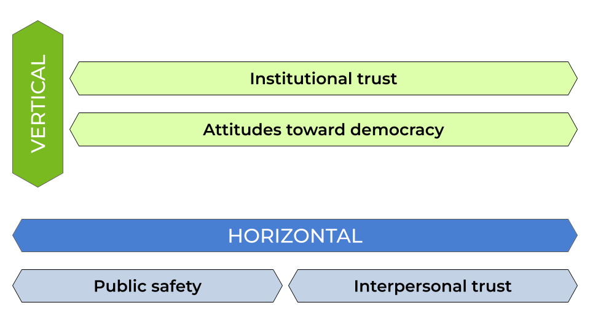

# Methodology

## Data

The main source of data for this study is the AmericasBarometer of the [Latin American Public Opinion Project](https://ropercenter.cornell.edu/latin-american-public-opinion-project-lapop), also known as the LAPOP Survey. The survey aims to collect data on public opinion about democracy and governance in the Americas. The survey design is probabilistic and representative of the adult population in each country [@lapoplab_americasbarometer_2023].

The survey has been conducted regularly since 2004. To date, nine waves have been carried out, covering between 11 and 23 countries, with a total of over 400,000 interviews in two decades. The questionnaire is administered through face-to-face surveys, with the exception of Canada and the United States.

As a criterion, this study included only those countries in the region that had data available for the main indicators of the study at least five points in time. As summarized in @tbl-paises, this study includes a total of 238,257 individuals nested in 174 country waves in 25 countries in the Americas.

```{r}
#| label: tbl-paises
#| echo: false
#| message: false
#| warning: false
#| tbl-cap: Data availability by waves and countries

rm(list = ls())

library(tidyverse)
library(janitor)
library(knitr)
library(ggplot2)
library(kableExtra)
library(here)

load(here("input/proc/datos-fit.rdata"))
load(here("input/proc/datos-completos.rdata"))
load(here("input/proc/micro-macro-merge.rdata"))

datos_merge <- datos_merge |> ungroup()

tabla <- datos_fit |>
  count(
    Country = haven::as_factor(pais),
    Wave  = haven::as_factor(ola)
  ) |>
  pivot_wider(
    names_from  = Wave,
    values_from = n,
    values_fill = 0,
    names_sort = TRUE
  ) |>
  adorn_totals("row") |>
  adorn_totals("col") |>
  kable() |>
  kable_styling(
    full_width = FALSE,
    bootstrap_options = c("striped")
  )

tabla
```

For contextual data on countries, various data sources were used, including:

1) Open data from the World Bank. This contains various indicators on social and economic development for most countries in the world. The data portal is accessible at: [https://datos.bancomundial.org/](https://datos.bancomundial.org/).

2) The World Bank's Worldwide Governance Indicators. This is a survey of experts that collects data on various governance indicators, covering multiple countries with information updated between 1996 and 2003. The data is available at: [https://www.worldbank.org/en/publication/worldwide-governance-indicators](https://www.worldbank.org/en/publication/worldwide-governance-indicators).

3) The V-Dem Dataset. It collects a multidimensional set of data that seeks to measure the quality of democracy around the world. The database is accessible through the R package `vdemdata` [@maerz_vdemdata_2025].

## Variables

### Dependent Variables

A Social Cohesion Index was constructed, comprising two dimensions which, in turn, are summary indices constructed from LAPOP indicators. The selection of indicators, sub-dimensions, and dimensions is based on previous work at the aggregate level by the Social Cohesion Observatory, accessible here: [https://ocscoes.github.io/medicion-cohesion-LA/](https://ocscoes.github.io/medicion-cohesion-LA/).

The **Horizontal Cohesion Index** consists of two sub-dimensions: Urban Safety and Interpersonal Trust. Urban Safety includes indicators of objective safety and subjective safety. Interpersonal Trust, meanwhile, is a single indicator of how trustworthy people are in general.

The **Vertical Cohesion Index** consists of two dimensions: Trust in Institutions and Attitudes toward Democracy. Trust in Institutions includes indicators related to citizens' trust in Congress, the judiciary, and political parties. Attitudes toward Democracy consists of two indicators on support for the democratic system and satisfaction with the functioning of democracy in one's country.

The indicators were standardized so that all sub-dimensions and dimensions of the indices have a range from 0 to 10, with 0 indicating low levels of social cohesion and 10 indicating high levels of cohesion.

#### Item-level descriptives

Before presenting the aggregated indices by dimension, @tbl-items describes the original items composing each sub-dimension of the social cohesion index. All items were standardized to a 0–10 scale prior to index construction, with higher values indicating greater cohesion.

**Horizontal Cohesion** is built from two sub-dimensions. The *Interpersonal Trust* sub-dimension is measured with a single item (`it1`): the general perception of how trustworthy people are, originally on a 1–4 scale and reversed so that higher values indicate greater trust. The *Urban Safety* sub-dimension combines a subjective indicator (`aoj11`) — perceived safety in the neighborhood (1–4, reversed) — and an objective victimization indicator (`vic1ext`): whether the respondent was the victim of a crime in the past year (dichotomous).

**Vertical Cohesion** is likewise built from two sub-dimensions. *Institutional Trust* aggregates trust in Congress (`b13`), in political parties (`b21`), and in the judiciary (`b31`), all on a 1–7 scale. *Attitudes toward Democracy* combines support for the political system (`ing4`, 1–7 scale) and satisfaction with the functioning of democracy in the country (`pn4`, 1–4 scale, reversed).

```{r}
#| label: tbl-items
#| echo: false
#| tbl-cap: Descriptive statistics for social cohesion items (scale 0–10)

items_desc <- datos_merge |>
  ungroup() |>
  select(it1, aoj11, vic1ext, b13, b21, b31, ing4, pn4) |>
  summarise(across(
    everything(),
    list(
      Mean = ~round(mean(.x, na.rm = TRUE), 2),
      SD   = ~round(sd(.x,   na.rm = TRUE), 2),
      Min  = ~round(min(.x,  na.rm = TRUE), 0),
      Max  = ~round(max(.x,  na.rm = TRUE), 0),
      N    = ~sum(!is.na(.x))
    ),
    .names = "{.col}__{.fn}"
  )) |>
  pivot_longer(everything(),
               names_to  = c("Item", "Statistic"),
               names_sep = "__") |>
  pivot_wider(names_from = "Statistic", values_from = "value") |>
  mutate(
    Dimension = case_when(
      Item %in% c("it1")              ~ "Interpersonal Trust",
      Item %in% c("aoj11", "vic1ext") ~ "Urban Safety",
      Item %in% c("b13", "b21", "b31") ~ "Institutional Trust",
      Item %in% c("ing4", "pn4")      ~ "Attitudes toward Democracy"
    ),
    Item = recode(Item,
      "it1"     = "Interpersonal trust",
      "aoj11"   = "Subjective neighborhood safety",
      "vic1ext" = "Objective victimization",
      "b13"     = "Trust in Congress",
      "b21"     = "Trust in political parties",
      "b31"     = "Trust in the judiciary",
      "ing4"    = "Support for the political system",
      "pn4"     = "Satisfaction with democracy (pn4)"
    )
  ) |>
  select(Dimension, Item, Mean, SD, Min, Max, N)

items_desc |>
  kable(align = c("l", "l", "r", "r", "r", "r", "r")) |>
  kable_styling(full_width = FALSE, bootstrap_options = "striped") |>
  collapse_rows(columns = 1, valign = "top")
```

@fig-likert displays the regional average for each item, allowing a comparison of cohesion levels across sub-dimensions.

```{r}
#| label: fig-likert
#| echo: false
#| fig-cap: Distribution of social cohesion items by dimension (regional average, scale 0–10)
#| fig-height: 6
#| fig-width: 9

items_long <- datos_merge |>
  select(it1, aoj11, vic1ext, b13, b21, b31, ing4, pn4) |>
  pivot_longer(everything(), names_to = "item", values_to = "value") |>
  filter(!is.na(value)) |>
  mutate(
    item = recode(item,
      "it1"     = "Interpersonal\ntrust",
      "aoj11"   = "Subjective\nsafety",
      "vic1ext" = "Objective\nvictimization",
      "b13"     = "Trust in\nCongress",
      "b21"     = "Trust in\nparties",
      "b31"     = "Trust in\njudiciary",
      "ing4"    = "Support for\npolitical system",
      "pn4"     = "Satisfaction with\ndemocracy"
    ),
    dimension = case_when(
      item %in% c("Interpersonal\ntrust", "Subjective\nsafety", "Objective\nvictimization")
        ~ "Horizontal Cohesion",
      TRUE ~ "Vertical Cohesion"
    )
  ) |>
  group_by(dimension, item) |>
  summarise(
    mean = mean(value, na.rm = TRUE),
    se   = sd(value,  na.rm = TRUE) / sqrt(n()),
    .groups = "drop"
  )

ggplot(items_long, aes(x = mean, y = reorder(item, mean), fill = dimension)) +
  geom_col(width = 0.6) +
  geom_vline(xintercept = 5, linetype = "dashed", color = "grey50", linewidth = 0.4) +
  scale_x_continuous(limits = c(0, 10), breaks = seq(0, 10, 2)) +
  scale_fill_manual(values = c("Horizontal Cohesion" = "#2166AC",
                               "Vertical Cohesion"   = "#D6604D")) +
  facet_wrap(~dimension, scales = "free_y", ncol = 1) +
  labs(
    x    = "Regional average (scale 0–10)",
    y    = NULL,
    fill = NULL
  ) +
  theme_minimal(base_size = 12) +
  theme(
    legend.position  = "none",
    panel.grid.minor = element_blank(),
    strip.text       = element_text(face = "bold", size = 11),
    axis.text.y      = element_text(size = 10)
  )
```

### Independent Variables

Economic, institutional, and cultural factors were included as independent variables. Recognizing the hierarchical structure of the data, predictors were considered at the individual level, at the wave-country level, and at the country level.

#### Individual-level variables

The analytical sample comprises a total of 238,257 individuals distributed across 174 country-wave combinations in 25 countries of the Americas. The main individual predictor in this study is **educational level**, operationalized from the years of schooling reported by respondents. This variable was recoded into three categories: primary education (up to 6 years of schooling), secondary education (7 to 12 years), and tertiary education (more than 12 years). When the years-of-schooling variable was unavailable, alternative educational level variables reported in different LAPOP questionnaire waves (`edr`, `edre`) were used, unified under the same three-category scheme. Educational level serves as the main individual predictor and as an indicator of socioeconomic status (SES).

**Political position** was measured originally on a continuous 1–10 scale (1 = left, 10 = right), available across variables `l1`, `l1b`, and `l1n` depending on the wave. This scale was recoded into three categories: left (1–4), center (5–6), and right (7–10). Respondents who did not declare any position were recorded as a separate category ("Not declared") and treated as missing values in the regression models.

**Income decile** was constructed from different versions of the household income variable available in each wave (`q10`, `q10new_12`, `q10new_14`, `q10new_16`, `q10new_18`, `q10inc`). Given that income scales vary across countries and waves, for waves from 2012 onward the variable was transformed into deciles within each country-wave combination using the `ntile()` function, where 1 corresponds to the lowest income decile and 10 to the highest. For waves prior to 2012, the original scale of variable `q10` was used directly.

**Sex** was recoded as a dichotomous variable (0 = woman, 1 = man) from variables `q1`, `q1tb`, or `q1tc_r` depending on availability. **Age** was calculated directly from variable `q2` or, when unavailable, as the difference between the wave year and the birth year (`q2y`). Both sex and age are included as control variables in the models.

@tbl-vars-individuales presents the distribution of categorical individual variables, and @tbl-continuas reports descriptive statistics for the continuous ones.

```{r}
#| label: tbl-vars-individuales
#| echo: false
#| tbl-cap: Distribution of categorical individual variables

# Educational level
tab_educ <- datos_merge |>
  count(nivel_educ) |>
  mutate(
    Variable = "Educational level",
    Category = as.character(nivel_educ),
    `%` = round(n / sum(n) * 100, 1)
  ) |>
  select(Variable, Category, n, `%`)

# Political position
tab_pol <- datos_merge |>
  filter(pos_politica != "Not declared") |>
  count(pos_politica) |>
  mutate(
    Variable = "Political position",
    Category = as.character(pos_politica),
    `%` = round(n / sum(n) * 100, 1)
  ) |>
  select(Variable, Category, n, `%`)

# Sex
tab_sexo <- datos_merge |>
  count(sexo) |>
  mutate(
    Variable = "Sex",
    Category = as.character(sexo),
    `%` = round(n / sum(n) * 100, 1)
  ) |>
  select(Variable, Category, n, `%`)

bind_rows(tab_educ, tab_pol, tab_sexo) |>
  kable(
    col.names = c("Variable", "Category", "n", "%"),
    align     = c("l", "l", "r", "r")
  ) |>
  kable_styling(full_width = FALSE, bootstrap_options = "striped") |>
  collapse_rows(columns = 1, valign = "top")
```

```{r}
#| label: tbl-continuas
#| echo: false
#| tbl-cap: Descriptive statistics for continuous individual variables

datos_merge |>
  summarise(
    across(
      c(edad, income_decile, escolaridad),
      list(
        Mean = ~round(mean(.x, na.rm = TRUE), 2),
        SD   = ~round(sd(.x,   na.rm = TRUE), 2),
        Min  = ~round(min(.x,  na.rm = TRUE), 2),
        Max  = ~round(max(.x,  na.rm = TRUE), 2),
        N    = ~sum(!is.na(.x))
      ),
      .names = "{.col}__{.fn}"
    )
  ) |>
  pivot_longer(everything(),
               names_to  = c("Variable", "Statistic"),
               names_sep = "__") |>
  pivot_wider(names_from = "Statistic", values_from = "value") |>
  mutate(Variable = recode(Variable,
    "edad"          = "Age",
    "income_decile" = "Income decile",
    "escolaridad"   = "Years of schooling"
  )) |>
  kable(align = c("l", "r", "r", "r", "r", "r")) |>
  kable_styling(full_width = FALSE, bootstrap_options = "striped")
```

#### Contextual variables

Contextual variables are incorporated into the model at two levels: variation between countries ($\bar{Z}_j$) and variation within each country over time ($Z_{jt} - \bar{Z}_j$), following the decomposition of the hybrid model described in the methods section. All macro-level variables are described below, including their conceptual definition and measurement scale.

**Economic prosperity** was measured using GDP per capita at purchasing power parity (PPP), expressed in constant international dollars and log-transformed to reduce distributional skewness. Higher values indicate greater economic development. Data come from the World Bank and are available for the 2004–2023 period.

**Economic inequality** was operationalized through the Gini index, which measures dispersion in the income distribution. Its scale ranges from 0 (perfect equality) to 100 (perfect inequality). Data come from World Bank estimates.

**Democratic quality** was measured using the Electoral Democracy Index (polyarchy, `v2x_polyarchy`) from the V-Dem dataset. This index captures the degree to which electoral democracy is achieved in practice, considering dimensions such as freedom of expression, clean elections, universal suffrage, and the existence of elected officials. Its scale ranges from 0 to 1, where 1 indicates the highest democratic quality. Data come from the `vdemdata` R package [@maerz_vdemdata_2025].

**Governance quality** was measured through a composite index constructed from the six indicators of the World Bank's Worldwide Governance Indicators (WGI): control of corruption, government effectiveness, political stability, rule of law, regulatory quality, and voice and accountability. The six indicators show high internal consistency ($\alpha$ = 0.96) and were averaged into a single index [@kaufmann_worldwide_2024]. Each original indicator is expressed in standard deviation units with a mean of zero, so the composite index is interpreted on the same scale, with higher values indicating better governance.

**Migration** was used as a proxy for cultural diversity, measured as the percentage of the migrant population relative to the total population. Data come from the World Bank, available every five years; intermediate years were imputed using logistic interpolation to construct a continuous annual series. The variable is expressed as a percentage (0–100).

**Ethnic fractionalization** understood as a measure of cultural and ethnic diversity was measured using the ethnic fractionalization index (fe_etfra) from the Quality of Government (QoG) dataset. This index captures the probability that two randomly selected individuals in a country belong to different ethnic groups, ranging from 0 (no fractionalization) to 1 (maximum fractionalization). Higher values indicate greater ethnic diversity.

```{r}
#| label: tbl-vars-macro
#| echo: false
#| tbl-cap: Descriptive statistics for contextual variables (country-wave level)

vars_macro <- datos_wide |>
  mutate(fe_etfra = as.numeric(gsub(",", ".", fe_etfra))) |>
  group_by(pais, ola) |>
  slice(1) |>
  ungroup() |>
  select(
    `Log GDP per capita (PPP)` = `(Log) PIB per cápita (PPA)`,
    `Gini index`,
    `V-Dem index (polyarchy)`  = `Indice V-Dem`,
    `Governance index (WGI)`   = wgi,
    `Migrant population (%)`   = `% pob. migrante`,
    `Ethnic fractionalization` = fe_etfra
  )

class(datos_wide$fe_etfra)
head(datos_wide$fe_etfra)

vars_macro |>
  summarise(
    across(
      where(is.numeric),
      list(
        Mean = \(x) round(mean(x, na.rm = TRUE), 2),
        SD   = \(x) round(sd(x,   na.rm = TRUE), 2),
        Min  = \(x) round(min(x,  na.rm = TRUE), 2),
        Max  = \(x) round(max(x,  na.rm = TRUE), 2)
      ),
      .names = "{.col}__{.fn}"
    )
  ) |>
  pivot_longer(everything(),
               names_to  = c("Variable", "Statistic"),
               names_sep = "__") |>
  pivot_wider(names_from = "Statistic", values_from = "value") |>
  kable(align = c("l","r","r","r","r")) |>
  kable_styling(full_width = FALSE, bootstrap_options = "striped")
```

### Note on the Analytical N

The number of cases entering the multilevel models differs from the total observations available in the dataset. The N reported in @tbl-paises corresponds to cases with complete information on all items composing the overall cohesion index, and also excludes the 2021 wave, which was collected via telephone and presents methodological differences with the remaining waves. Cases with missing values on any individual or contextual variable are excluded through listwise deletion when estimating the models.

## Method

### Confirmatory Factor Analysis

A confirmatory factor analysis was performed to test the model constructed by the Social Cohesion Observatory [-@observatoriodecohesionsocial_medicion_2025] and the theoretical proposal by @chan_reconsidering_2006. As can be seen in @fig-modelo, social cohesion is understood as a latent construct consisting of two latent dimensions: vertical cohesion and horizontal cohesion.

{#fig-modelo}

### Multilevel Analysis

Given the hierarchical structure of the data, hybrid multilevel regression models were estimated. This technique allows individual-level data to be used to decompose country-level effects into their components between countries (between effects) and within a country over time (within effects) [@schmidt-catran_random_2016; @fairbrother_two_2014]. The models were estimated using the R package `lme4` [@bates_fitting_2015].

The proposed model could be formally expressed as:

$$
y_{jti} = \beta_{0}(t) + \beta_{1}X_{jti} + \gamma_{we}(Z_{jt}-\bar{Z}_{j}) + \gamma_{be}\bar{Z}_{j} + v_j + u_{jt} + e_{jti}
$$

The model integrates three levels with individuals $i$ nested in wave-countries $t$ nested in countries $j$. $X_{jti}$ represents individual-level variables, while $Z_{jt}$ are contextual variables at the wave-country level. Given that $Z_{jt}$ contains variance at both level 2 and level 3, it was decomposed into the average of the variable across all its waves ($\bar{Z}_{j}$) and the intra-country deviation in a given wave ($Z_{jt}-\bar{Z}_{j}$). Thus, $\gamma_{we}$ represents the within effect — the effect of change in a country over time — while $\gamma_{be}$ represents the between effect — structural differences between countries. In addition, $\beta_{0}(t)$ controls for changes over time not explained by the model. Finally, $v_j$, $u_{jt}$, and $e_{jti}$ represent the errors at the country, wave-country, and individual levels.
