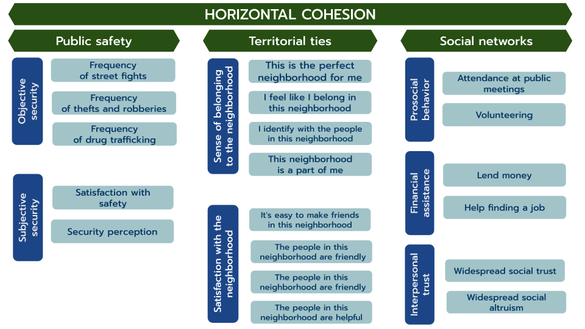

---
format:
  revealjs:
    theme: ocs.scss
    transition: fade
    transition-speed: slow
    slide-number: true
    fig-cap-location: bottom
editor: source  
---

# VISELSOC {data-background-color="#212525"}

:::{.notes}

Hello everyone, my name is Tomás Urzúa, and over the past year and this current one, I have been studying social cohesion. I served as a research assistant at the Social Cohesion Observatory, and in that context, I’m here today to present one of the most important tools we developed as a team: the Longitudinal Visualizer of Social Cohesion in Chile, or VISELSOC, as it’s commonly known.

:::

## Bullet points

- Construction

- Data

- Measurement 

- Results

:::{.notes}

The presentation will be structured around four main points: the construction of the visualizer, the data we used, how we measured social cohesion, and finally, the results we can see through the visualizer.

:::

## Construction

:::{.incremental .highlight-last}

- The visualizer’s aesthetic, theoretical, and methodological design was created entirely by the team at the Observatory of Social Cohesion (OCS).

- It was built using code with Quarto and Shiny App.

- The visualizer’s source code is open access and can be found in our [GitHub repository](https://github.com/ocscoes/OCSVIS-ELSOC)

:::

:::{.notes}

- I don´t know if all of you are familiar with Quarto, but Quarto is an open-source publishing system that allows you to create dynamic, reproducible documents, while Shiny App is a Quarto output format that enables the creation of interactive web applications.

- GitHub it is a platform that allows you to store, share, and collaborate on open-source software projects. In our case, this means that anyone can access and review it.

:::

## Data

:::{.incremental .highlight-last}

- We used secondary data from [Chilean Longitudinal Social Study (ELSOC)](https://conferencias.coes.cl/encuesta-panel/)

- It is a longitudinal survey that tracks the same individuals annually from 2016 to 2023, making it the only study of its kind in Chile and Latin America

- For the visualization, the analysis includes participants who took part in at least three waves of the study, totaling 3,666 individuals.

:::

:::{.notes}

ELSOC is the Chilean Longitudinal Social Study, a representative survey of Chile’s urban population. The survey began in 2016 (two thousand sixteen) and was conducted annually through 2023 (two thousand twenty-three), making it a unique source of information of its kind in Chile and Latin America. 

For the creation of the visualizer, only respondents who participated in at least three waves of the study were considered, resulting in a total of three thousand six hundred sixty-six individuals.

:::

## Measurement

:::{.incremental .highlight-last}
- We developed a measurement framework for social cohesion in Chile based on the approach proposed by Chan et al. (2006).

- The framework is based on two dimensions:

  -  Horizontal: addresses the relationships between individuals and social groups

  -  Vertical: captures the interactions between individuals and social institutions
:::

## 

:::{.notes}

In the case of **horizontal cohesion**, we can see that there are three subdimensions: public safety, territorial ties, and social networks.

Public safety consists of objective safety—such as the frequency of exposure to violent situations—and subjective safety, which refers to perceptions of safety.

Territorial ties measures people’s sense of belonging to their neighborhood and residents’ satisfaction with their local area.

Social networks are composed of three subdimensions: prosocial behavior, financial assistance, and interpersonal trust.

:::

## 

:::{.notes}

For **vertical cohesion**, we have four subdimensions. First, Trust in institutions, which measures trust in various political institutions such as the government, political parties, and Congress

Second, political attitudes and participation which is a fairly straightforward subdimension

Then, we have preferences for authoritarianism, which captures the extent to which individuals support authoritarian values and practices.

Finally, we have distributive justice that is composed by how unfair people consider the distribution of healthcare, education, and pensions to be

:::

## Measurement

:::{.incremental .highlight-last}
- We applied a several analytical techniques for to arrive at the final version of the measurement framework.

- Sub-dimensions were calculated as average indices to facilitate the interpretation of the results.

- All the decisions behind the construction of the framework can be found in this [methodological document](https://ocscoes.github.io/propuesta-medicion-elsoc/output/book-cohesion-elsoc/docs/).
:::

:::{.notes}

such as descriptive analyses, correlation matrices, both exploratory and confirmatory factor analysis to verify that the model’s underlying structure was optimal for its application in the Chilean context.

Although we confirmed the factor structure of the data, all sub-dimensions were calculated as average indices to facilitate the interpretation of the results

:::

# Results [VISELSOC](https://ocs-coes.shinyapps.io/ocs-viselsoc/#)

